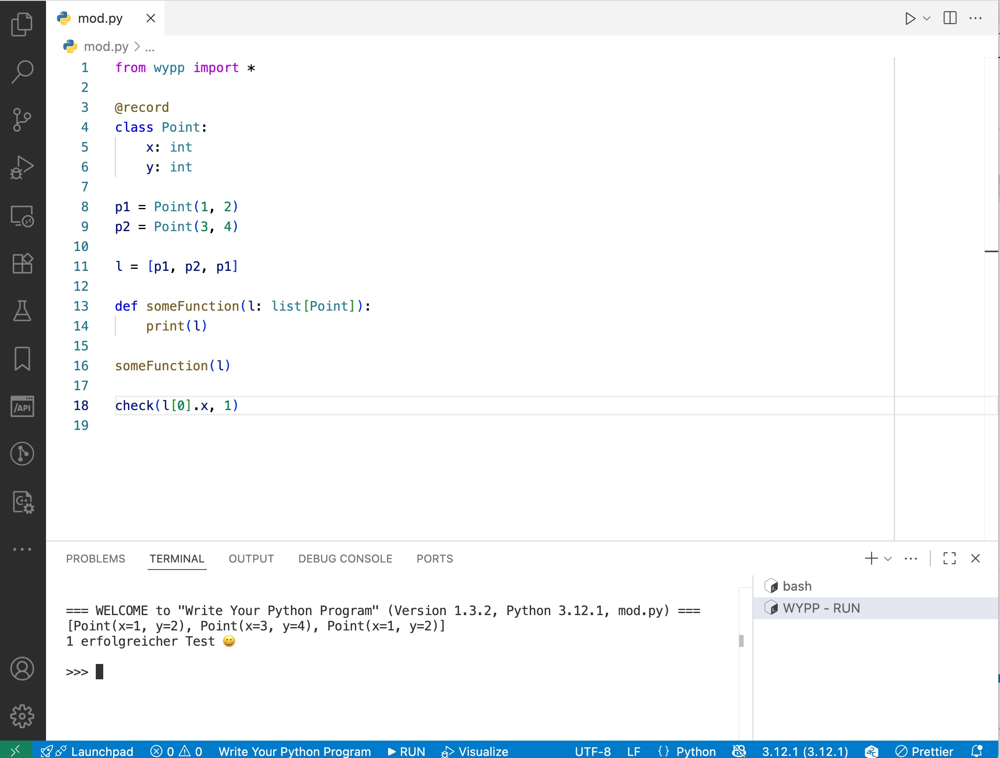

# Write Your Python Program

A user-friendly python programming environment for beginners.

The ideas of this environment are based on the great ideas from
[Schreib dein Programm!](https://www.deinprogramm.de/sdp/).

## Quick start

* Step 1. Install Python 3.8.x. I've tested with 3.8.5, I guess 3.9.x schould also work
  but I did not check.
* Step 2. Install the write-your-python-program extension. You need at least Visual Studio Code
  version 1.49.0.
* Step 3. Open or create a Python file. The "RUN" button in the taskbar at the bottom will
  run your file with the teaching language provided by write-your-python-program.

### Troubleshooting

- By default, the extension use the python interpreter of the regular python extension.
  To use a different interpreter, configure it in the settings.
- The extension disables linting of Python code when activated. This is well-suited for beginners
  but might cause unwanted effects when you rely on linting. In such cases, you have to
  deactivate the extension.

## What's new?

Here is the [Changelog](ChangeLog.md).

## Features

Here is a screen shot:

When hitting the RUN button, the vscode extension saves the current file, opens
a terminal and executes

~~~
python3 -i /path/to/extension/python/src/runYourProgram.py CURRENT_FILE.py
~~~

This makes the following features available:

### Type Definitions

You can define enums, records and mixed data types and the use them with the type hints of
Python 3. At the moment, such type hints serve only the purpose of documentation. A later iteration
of the "write your python program" extension will use the type hints for dynamic
type checks.

#### Enums

~~~python
Color = Enum('red', 'green', 'blue')
~~~

#### Records

~~~python
@record
class Record:
    x: float
    y: float

@record
class Circle:
    center: Point
    radius: float
~~~

You work with a record like this:

~~~python
p = Point(2, 3) # point at x=2, y=3
print(p.x)      # Print 2
~~~

#### Mixed Data Types

~~~python
PrimitiveShape = Mixed(Circle, Square)
~~~

To use recursive types, you need `DefinedLater`:

~~~python
Shape = Mixed(Circle, Square, DefinedLater('Overlay'))
Overlay = Record("Overlay", "top", Shape, "bottom", Shape)
~~~

Case distinction works like this:

~~~python
def workOnShape(s: Shape):
    if Square.isSome(s):
        # s is a Square, do something with it
    elif Circle.isSome(s):
        # s is a Circle, do something with it
    elif Overlay.isSome(s):
        # s is an Overlay, do something with it
    else:
        uncoveredCase()
~~~

If your mixed type is made up of primitive types such as str or int, you can also use
`hasType(ty, value)` for checking if `value` has some type `ty`.

### Tests

Tests are defined via `check`. The first argument of check is the actual result,
then second argument the expected result.

~~~python
check(factorial(4), 24)
~~~

### Import

You don't have to import the features explicitly, but you can import them like this:

~~~python
from wypp import *
~~~

This allows integration with tools like to python debugger.

## Hacking

You can debug the extension from Visual Studio Code:

* Open the main folder of the plugin with vscode.
* Open the file `extension.ts`.
* Choose "Run" from the menu, then "Start Debugging".
