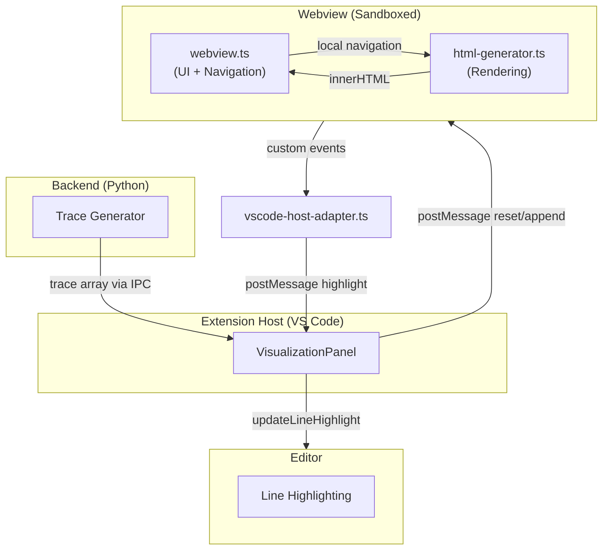

# Architecture Overview

## Components

### **Webview (web/)**
The self-contained UI component that the user interacts with:
- **webview.ts**: Manages trace navigation, rendering, and local state. Navigation (prev/next/first/last) is fully local; after updating the visualization, it emits a `highlight` message for line highlighting in the editor.
- **html-generator.ts**: Converts backend trace elements into HTML fragments for display.
- **vscode-host-adapter.ts**: Bridges between the webview's custom events and the VS Code webview API. Non-VS Code environments work unchanged (mock postMessage).
- **index.html**: DOM structure, control buttons, and output panes.
- **webview.css**: Layout and styling.
- **example-trace-content.js**: Optional sample trace for design/development mode.

### **Panel (frontend/)**
The VS Code extension-side host that owns the webview:
- **visualization_panel.ts**: Creates and manages the webview panel lifecycle. Receives `reset` and `append` messages from the trace backend, posts them to the webview. Handles `highlight` messages from the webview to update editor line highlighting.

## Message Flow

## Data Flow

1. **Initial Load / Panel Refocus**: Panel sends full trace array to webview via `reset` message.
2. **Streaming Trace**: Backend sends trace elements; panel forwards via `append` message.
3. **User Navigation**: User clicks buttons or moves slider → local navigation in webview updates `traceIndex` → renders visualization → emits `highlight` message.
4. **Editor Synchronization**: Panel receives `highlight` message → opens file and highlights line in editor.
5. **Standalone Mode**: webview works standalone (desktop or browser) via static trace injection in development, no postMessage needed.

## WebDev

You can develop the design of the visualization using an example trace in your browser. For concrete instructions check out base-repo README.